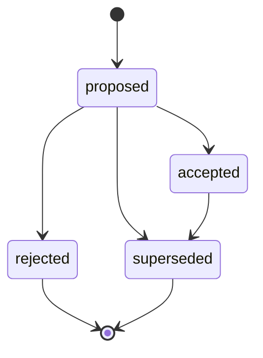

# 10 Build Plan

This is a suggested sequence for several Codex sessions in a new repo.

## Session 1: Create skeleton and domain model

Goal: establish names and package boundaries.

Tasks:

1. Create repo structure.
2. Add domain dataclasses or Pydantic models:
   - Event
   - Workspace
   - Session
   - Goal
   - Entity
   - Fact
   - ToolSpec
   - Toolkit
   - ToolNeed
   - Decision
   - PolicyDecision
3. Add in-memory EventLedger.
4. Add basic tests for append/list events.
5. Add README with the one-sentence product definition.

Deliverable:

```text
seed_runtime/models.py
seed_runtime/events.py
tests/test_events.py
```

## Session 2: State projector

Goal: rebuild state from events.

Tasks:

1. Implement State object.
2. Implement StateProjector.
3. Support events:
   - entity.upserted
   - fact.observed
   - goal.created
   - tool_need.created
   - approval.granted
4. Add tests proving deterministic projection.

Deliverable:

```text
seed_runtime/state.py
tests/test_state_projector.py
```

## Session 3: Decision schema and validator

Goal: constrain model outputs.

Tasks:

1. Implement Decision model.
2. Implement DecisionValidator.
3. Validate:
   - required fields by kind
   - propose_handoff_plan references registered CapabilityCatalog backend
   - request_tool has valid name/summary
   - ask_question includes question
4. Add tests for valid/invalid decisions.

Deliverable:

```text
seed_runtime/decisions.py
tests/test_decisions.py
```

## Session 4: Tool registry and manifest loader

Goal: load registered tools from toolkit manifests.

Tasks:

1. Define toolkit manifest schema.
2. Implement YAML/JSON loader.
3. Implement ToolRegistry.
4. Add sample core toolkit.
5. Add tests for loading and rejecting invalid manifests.

Deliverable:

```text
seed_runtime/registry.py
toolkits/core/echo/toolkit.yaml
tests/test_registry.py
```

## Session 5: Policy gate

Goal: separate desire from execution.

Tasks:

1. Implement risk classes.
2. Implement PolicyGate.
3. Add simple policy table.
4. Implement approval lookup stub.
5. Add tests:
   - L1 allow
   - L3 requires approval
   - unknown action blocks or approval-gates

Deliverable:

```text
seed_runtime/policy.py
tests/test_policy.py
```

## Session 6: Context composer

Goal: present state to the model before execution logic grows. Even a dumb deterministic composer keeps model-facing context out of workflow code.

Tasks:

1. Implement ContextComposer.
2. Select active goal.
3. Select relevant entities and facts.
4. Select visible tools.
5. Include open Tool Needs.
6. Add deterministic tests for context packet shape.

Deliverable:

```text
seed_runtime/context.py
tests/test_context.py
```

## Session 7: Handoff planning path

Goal: safely create non-executable HandoffPlans after the runtime has a stable context packet boundary.

Tasks:

1. Implement HandoffPlan model/service.
2. Validate target schema.
3. Summarize policy metadata.
4. Select provider/backend from CapabilityCatalog.
5. Force `executable: false`.
6. Append handoff events.
7. Add an `echo`/manual backend for safe testing.

Deliverable:

```text
seed_runtime/execution.py
toolkits/core/echo/operations.py
tests/test_execution.py
```

## Session 8: Runtime loop without real LLM

Goal: complete the boring MVP loop with a fake model and no generated tools.

MVP path:

```text
user input
-> append input.user_message event
-> project state
-> compose context
-> fake model returns Decision
-> validate Decision
-> echo tool or request_tool
-> append result event
-> project state in tests
```

Tasks:

1. Define DecisionModel protocol.
2. Implement FakeDecisionModel for tests.
3. Implement Runtime.handle_user_message.
4. Route decisions:
   - answer
   - ask_question
   - request_tool
   - propose_handoff_plan against the core `echo`/manual backend only
5. Add tests for each branch and one end-to-end MVP event/state projection test.

Deliverable:

```text
seed_runtime/runtime.py
tests/test_runtime_loop.py
```

## Session 9: Tool Need service

Goal: first-class missing tool requests.

Tasks:

1. Implement ToolNeedService.
2. Deduplicate similar Tool Needs.
3. Add statuses.
4. Add tests:
   - creates Tool Need from decision
   - does not duplicate open need
   - records event

Deliverable:

```text
seed_runtime/tool_needs.py
tests/test_tool_needs.py
```

## Session 10: Evidence and Fact System

Goal: separate observations from facts.

Seed's runtime should make the evidence-to-fact pipeline explicit before generated tools expand what the system can observe. Tools produce observations, Evidence preserves those observations, Facts project validated interpretations, State composes those Facts, and Decisions choose whether to answer, ask, or call tools.

Tasks:

1. Implement Evidence model.
2. Implement Fact model.
3. Implement FactExtractor.
4. Implement FactValidator.
5. Record provenance links.
6. Add freshness support.

Deliverable:

```text
seed_runtime/evidence.py
seed_runtime/facts.py
tests/test_fact_extraction.py
```

## Session 11: Builder skeleton

Goal: generate toolkit candidates from Tool Needs only after the Session 8 runtime loop is passing. Do not start here; no builder, real LLM adapter, Ansible toolkit, or generated tools are part of the runtime MVP.


Tasks:

1. Create `seed_builder` package.
2. Implement candidate store.
3. Implement template generator:
   - toolkit manifest
   - schemas
   - operation stub
   - tests stub
   - docs
4. Add tests for generated file set.

Deliverable:

```text
seed_builder/generator.py
seed_builder/templates/
tests/test_builder_generator.py
```

## Session 12: Toolkit validator

Goal: reject bad generated candidates.

Tasks:

1. Validate manifest.
2. Validate JSON schemas.
3. Check implementation refs.
4. Check forbidden imports.
5. Run candidate tests.
6. Produce validation report.

Deliverable:

```text
seed_builder/validator.py
tests/test_toolkit_validator.py
```

## Session 13: Registration flow

Goal: move validated candidate into registry.

Tasks:

1. Add registration service.
2. Evaluate `toolkit.register` policy.
3. Register only validated candidates.
4. Emit events.
5. Reload registry.
6. Add tests.

Deliverable:

```text
seed_builder/registration.py
tests/test_toolkit_registration.py
```

## Session 14: First realistic generated toolkit

Goal: prove the concept with a harmless toolkit.

Choose a safe toolkit first, not SSH install.

Example: `host_notes`

Tools:

- `add_host_note(host, note)` — mutates only Seed state, not external host.
- `list_host_notes(host)` — read-only.

Why: tests the generation/register/context loop without remote infrastructure.

Deliverable:

```text
toolkits/generated/host_notes/...
```

## Session 14.5: Action Plan lifecycle guards

Goal: make Action Plan state transitions airtight before handoff preconditions, approvals, SSH, Docker, or any generated-capability mutation handoff path.

Lifecycle diagram:



Valid transitions:

- `proposed -> accepted`
- `proposed -> rejected`
- `proposed -> superseded`
- `accepted -> superseded`

Invalid examples that must raise `ActionPlanTransitionError` instead of appending lifecycle events:

- `accepted -> rejected`
- `rejected -> accepted`
- `rejected -> superseded`
- `superseded -> accepted`
- `superseded -> rejected`
- `superseded -> superseded`

Tasks:

1. Enforce lifecycle transitions in `ActionPlanService`.
2. Raise `ActionPlanTransitionError` for invalid transitions.
3. Add tests for every valid transition and every invalid transition.
4. Keep execution, credentials, retries, scheduling, SSH, and Docker work outside Seed behind external-provider handoff.

Deliverable:

```text
seed_runtime/action_plans.py
tests/test_action_plans.py
```

## Session 14.6: HandoffPlan framework

Goal: define the non-executable handoff artifact that follows Action Plan acceptance without creating an internal execution lifecycle.

Tasks:

1. Add a `HandoffPlan` model with `action_plan_id`, `provider`, `backend_type`, `operation`, `target`, `policy_summary`, `secret_boundary`, `requires_external_approval`, and `executable: false`.
2. Restrict `backend_type` to `ansible`, `mcp`, `temporal`, or `manual`.
3. Keep actual execution, secrets, retries, scheduling, long-running jobs, and credential prompts outside Seed.
4. Mark `ExecutionProposal` and `ExecutionAuthorization` experimental and not part of the core path.
5. Add tests that HandoffPlans reject secrets, cannot be executable, and cannot imply user approval, execution authorization, credential availability, provider trust, or tool registration.

Deliverable:

```text
seed_runtime/models.py
tests/test_handoff_plans.py
```

## Session 15: SSH access toolkit design

Goal: draft host automation as external-provider handoff only; do not execute mutating host tools inside Seed. Returned provider/manual observations become Evidence and observed Facts that participate in Fact Support Aggregation.

Handoff surfaces:

- `observe_ssh_access` / `verify_ssh_access` — external provider or manual observation whose result enters Seed as Evidence and supporting/conflicting Facts.
- `plan_ssh_install` — non-executable ActionPlan steps.
- `install_ssh_server` — external provider operation only; Seed emits HandoffPlan with `executable: false`.

Deliverable:

```text
toolkits/generated/ssh_access/...
```

Do not add a standalone FactVerification model here. Model current belief through Evidence, Facts, FactSupport aggregates, and conflicts.

## Session 16: Model integration

Goal: connect a real model behind DecisionModel.

Tasks:

1. Add model client interface.
2. Add local/small model adapter or hosted adapter.
3. Add strict JSON parsing.
4. Add retry on validation error.
5. Add eval cases.

Deliverable:

```text
seed_runtime/model_client.py
tests/test_model_contract.py
```

## Session 17: API shell

Goal: expose runtime without making API routes the architecture.

Endpoints:

- `POST /events/user-message`
- `GET /workspaces/{id}/state`
- `GET /toolkits`
- `GET /tools`
- `GET /tool-needs`
- `POST /tool-needs/{id}/generate`
- `POST /toolkit-candidates/{id}/validate`
- `POST /toolkit-candidates/{id}/register`

Deliverable:

```text
seed_runtime/api.py
```

## Session 18: Persistence

Goal: replace in-memory store.

Tasks:

1. Add SQLite or Postgres-backed event ledger.
2. Keep projector deterministic.
3. Add migration or schema init.
4. Add tests using temp DB.

## Session 19: Evaluation harness

Goal: stop guessing whether the loop works.

Tasks:

1. Create golden input cases.
2. Run model decisions against expected kind/tool/args.
3. Track validity and correctness.
4. Include small model and fake model modes.

## Session 20: Hardening

Tasks:

1. Redaction.
2. Timeouts.
3. Sandbox boundaries.
4. Approval expiry.
5. Toolkit versioning.
6. Context packet persistence.

## Session 21: Demo scenario

Build one coherent demo:

```text
User: "can you install ssh on node-1?"
Seed:
  - recognizes host
  - sees verify tool exists but install tool missing
  - creates Tool Need install_ssh_server
Builder:
  - generates ssh_access toolkit candidate
Validator:
  - validates manifest/schemas/tests
Runtime:
  - registers read-only verify tool
  - keeps install tool approval-gated or disabled
User:
  - asks again
Seed:
  - now sees tool exists but requires approval
```

## What not to build early

Avoid in early sessions:

- real arbitrary shell execution
- production SSH mutation
- complex UI
- vector database
- multi-agent orchestration
- self-modifying runtime
- giant provider library

First prove the loop.
