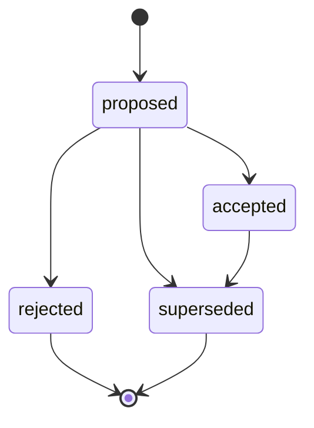

# Seed Prototype Implementation Status

This branch turns the Seed blueprint into a runnable Python prototype. The early Session 8 runtime loop is now in place, and the repository has advanced through the first builder and generated-toolkit milestones. The current priority is to keep host automation as external-provider handoff while treating returned observations as evidence-backed Fact Support, not as standalone verification state.

## Completed capabilities

- Runtime domain dataclasses for events, state objects, capabilities/tools metadata, ToolNeeds, decisions, approvals, pending actions, and policy decisions.
- In-memory and SQLite event ledgers with deterministic state projection.
- Toolkit manifest loading, tool registry, minimal JSON-schema validation, policy gating, approval/pending-action flow, and safe metadata-only local call handling for prototype utilities.
- Context composition and a runtime loop that can answer, ask questions, request tools, propose state patches, refuse unsafe requests, or propose non-executable handoff-adjacent artifacts.
- Tool Need service with open-need deduplication and status-change events.
- Evidence and fact models with extraction, state-projection, and Fact Support Aggregation support, so external observations and provider results can become provenance-preserving state instead of hidden memory.
- Text-only Action Plans with guarded lifecycle transitions, preventing accepted, rejected, or superseded plans from moving into contradictory states.
- Strict JSON model-decision parsing, prompt rendering, local-model adapters, intent-first local CLI behavior, and a golden-case evaluation harness.
- Dependency-light API shell for future web framework adapters.
- Builder candidate generation, candidate validation, and registration flow for moving validated generated toolkits into the registry.
- First harmless generated-style toolkit, `host_notes`, which records and lists host notes only in Seed's ledger.

## Fact Support Aggregation

Seed does not currently have a separate `FactVerification` framework. Verification is modeled as additional IN data: new Evidence and Facts from users, discovery, providers, imports, or deterministic inference. The state projector groups Facts by `subject + predicate + value` and produces `FactSupport` projections that preserve every supporting Fact ID, source type, first observation time, latest observation time, and aggregate confidence.

Seed should not stamp state with `verified: true`. Current belief is derived at query time from supporting and conflicting Facts, aggregate confidence, provenance source type, and recency. Conflicts remain visible when different values exist for the same `subject + predicate`; the best Fact/current belief is the value with the strongest aggregate support, not necessarily the single Fact with the highest individual confidence.

Terminology:

- **Observed fact** — a Fact extracted from direct input, discovery, provider output, or imported data.
- **Inferred fact** — a deterministic projection derived from observed Facts; it is useful but weaker than direct observed/provider/discovery support.
- **Supporting fact** — a Fact with the same `subject`, `predicate`, and `value` as another claim.
- **Conflicting fact** — a Fact with the same `subject` and `predicate` but a different `value`.
- **Best fact/current belief** — the representative Fact for the value with the strongest aggregate support.

## Action Plan lifecycle

Action Plans are durable, text-only proposals. Lifecycle events are accepted only through `ActionPlanService`, which enforces this state machine before appending an event:

Allowed transitions are exactly `proposed -> accepted`, `proposed -> rejected`, `proposed -> superseded`, and `accepted -> superseded`. Rejected and superseded plans are terminal, and accepted plans cannot be rejected. This keeps approval/handoff preconditions from seeing contradictory history such as `proposed -> accepted -> rejected`.

## External-provider handoff boundary

`action_plan.approved` remains plan acceptance. It is not credential approval and it is not permission for Seed to execute anything. ActionPlans are durable, text-only, non-executable plans.

The core path is now a `HandoffPlan` with `executable: false`. A HandoffPlan records the `action_plan_id`, `provider`, `backend_type` (`ansible`, `mcp`, `temporal`, or `manual`), `operation`, `target`, `policy_summary`, `secret_boundary`, and `requires_external_approval`. It is an auditable handoff artifact, not an approval, execution authorization, credential availability claim, provider-trust claim, tool registration, or execution lifecycle.

Seed owns context composition, the event ledger, state projection, facts/evidence, ToolNeeds, CapabilityCatalog, RecommendationRanker, non-executable ActionPlans, policy metadata, and the audit trail. Seed delegates actual execution, secrets, retries, scheduling, long-running jobs, and credential prompts. Preferred execution backends are Ansible/AWX for host automation, Temporal/Prefect for workflows, MCP servers for tool integration, and Vault/ssh-agent/sudo/become for secrets.

`ExecutionProposal` and `ExecutionAuthorization` remain experimental and are not part of the core path yet. They must not be used to continue building an internal execution lifecycle. Passwords, passphrases, raw tokens, private keys, and credential material are never stored in events, models, CLI arguments, HandoffPlans, ActionPlans, or the database.

## Deliberate constraints

- Generated toolkit manifests are JSON documents stored as `toolkit.yaml`; this keeps the loader dependency-free while leaving room for a YAML adapter later.
- Seed does not own actual execution; prototype local call surfaces are limited to safe utilities and metadata validation, while real work is handed to external providers.
- The builder emits untrusted stubs and validation reports rather than treating generated code as automatically safe.
- Generated toolkit registration remains explicit and policy-gated; generated code does not self-register.
- The API module is a framework-neutral shell, not a production HTTP server.
- Host automation remains external-provider handoff only. The prototype must not add real SSH mutation, shell execution, credential prompts, retries, scheduling, or network SSH access inside Seed.

## Suggested next steps

1. Add first-class HandoffPlan service/projection support for external-provider handoff without execution.
2. Reframe Session 15 `ssh_access` as capability metadata plus Ansible/AWX or manual HandoffPlan examples only.
3. Keep any future `install_ssh_server` surface outside Seed as an AWX/Ansible, MCP, Temporal/Prefect, or manual provider operation.
4. Add deeper candidate sandboxing beyond bounded pytest validation and static import checks before promoting more powerful builder output.
5. Add generated toolkit versioning and artifact copy/registration hardening for generated toolkit lifecycle management.
6. Add a proper HTTP adapter once endpoint semantics stabilize.
7. Expand policy tables from risk-class defaults into workspace-specific configuration.
8. Continue using the evaluation harness to check model decisions before relying on stronger local or hosted model adapters.
