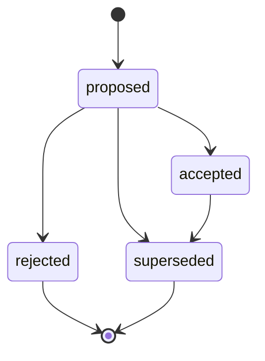

# Seed Prototype Implementation Status

This branch turns the Seed blueprint into a runnable Python prototype. The early Session 8 runtime loop is now in place, and the repository has advanced through the first builder and generated-toolkit milestones. The current priority is Session 15: add a safe `ssh_access` generated-toolkit design that can verify or plan without mutating a host.

## Completed capabilities

- Runtime domain dataclasses for events, state objects, tools, tool needs, decisions, approvals, pending actions, and policy decisions.
- In-memory and SQLite event ledgers with deterministic state projection.
- Toolkit manifest loading, tool registry, minimal JSON-schema validation, policy gating, approval/pending-action flow, and safe dynamic tool execution.
- Context composition and a runtime loop that can answer, ask questions, request tools, propose state patches, refuse unsafe requests, or call registered tools.
- Tool Need service with open-need deduplication and status-change events.
- Evidence and fact models with extraction and state-projection support, so tool outputs can become evidence-backed state instead of hidden memory.
- Text-only Action Plans with guarded lifecycle transitions, preventing accepted, rejected, or superseded plans from moving into contradictory states.
- Strict JSON model-decision parsing, prompt rendering, local-model adapters, intent-first local CLI behavior, and a golden-case evaluation harness.
- Dependency-light API shell for future web framework adapters.
- Builder candidate generation, candidate validation, and registration flow for moving validated generated toolkits into the registry.
- First harmless generated-style toolkit, `host_notes`, which records and lists host notes only in Seed's ledger.

## Action Plan lifecycle

Action Plans are durable, text-only proposals. Lifecycle events are accepted only through `ActionPlanService`, which enforces this state machine before appending an event:

Allowed transitions are exactly `proposed -> accepted`, `proposed -> rejected`, `proposed -> superseded`, and `accepted -> superseded`. Rejected and superseded plans are terminal, and accepted plans cannot be rejected. This keeps approval/execution preconditions from seeing contradictory history such as `proposed -> accepted -> rejected`.

## Deliberate constraints

- Generated toolkit manifests are JSON documents stored as `toolkit.yaml`; this keeps the loader dependency-free while leaving room for a YAML adapter later.
- The executor only runs registered Python callables after schema validation and policy evaluation; it does not provide arbitrary shell execution.
- The builder emits untrusted stubs and validation reports rather than treating generated code as automatically safe.
- Generated toolkit registration remains explicit and policy-gated; generated code does not self-register.
- The API module is a framework-neutral shell, not a production HTTP server.
- Host automation remains design-only unless it is read-only, deterministic, or approval-gated. The prototype must not add real SSH mutation, shell execution, or network SSH access yet.

## Suggested next steps

1. Add an execution-preconditions framework that consumes the now-guarded Action Plan lifecycle before any execution, approvals, SSH, Docker, or generated-tool mutation path.
2. Implement Session 15 `ssh_access` as a safe generated toolkit with read-only/stub verification and plan-only operations.
3. Keep any future `install_ssh_server` surface disabled, model-hidden, or L3 approval-gated until sandboxing, policy, and review workflows are stronger.
4. Add deeper candidate sandboxing beyond bounded pytest execution and static import checks before promoting more powerful builder output.
5. Add generated toolkit versioning and artifact copy/registration hardening for generated toolkit lifecycle management.
6. Add a proper HTTP adapter once endpoint semantics stabilize.
7. Expand policy tables from risk-class defaults into workspace-specific configuration.
8. Continue using the evaluation harness to check model decisions before relying on stronger local or hosted model adapters.
