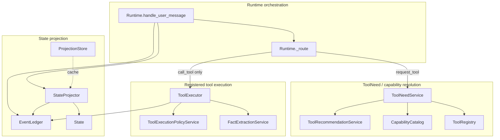

# Architecture Visualization Infrastructure: Phase 1 Evaluation

## Goal

Create architecture visualization infrastructure without manually documenting architecture. The architecture artifacts should be generated from code, with committed documentation limited to evaluation, recommendation, and proof-of-concept design for the generation pipeline.

## Recommendation

Use an **ownership-aware generated Mermaid graph as the primary architecture artifact**, with **Graphviz as an optional renderer/export path**, and keep **pyan3** and **pydeps** as supporting diagnostics only.

Seed's important architecture is not just what imports what. It is who owns behavior and which runtime branches enter which services. The current code and architecture guidance make ownership explicit:

- `Runtime` routes model decisions and delegates behavior to owner services.
- `ToolExecutor` owns registered tool execution.
- `ToolNeedService` owns capability-gap creation and capability resolution.
- `StateProjector` and `ProjectionStore` own projected state.
- `CapabilityCatalog` owns capability metadata and provider/handoff recommendations.

## Evaluation Summary

| Tool | Best use | Limitation | Recommendation |
| --- | --- | --- | --- |
| `pydeps` | Python module import dependency graph | Shows imports, not runtime branches, event paths, or ownership semantics | Use only as a low-level dependency diagnostic |
| `pyan3` | Static class/function call graph | Better than imports, but still does not encode ownership, policy boundaries, or semantic labels | Use as a supporting diagnostic for call-path validation |
| Graphviz | Rendering generated DOT to SVG | Does not discover architecture by itself | Use as optional renderer/export format |
| Mermaid generation | Human-readable committed architecture diagrams generated from code and metadata | Requires a small custom generator | Use as the primary committed architecture artifact |

## Answers

### 1. Which tool best shows the required paths?

Generated **Mermaid from code plus ownership metadata** is the best overall tool for the requested architecture questions.

| Architecture question | Best tool | Reason |
| --- | --- | --- |
| Runtime ownership | Mermaid generation | Runtime ownership is branch- and service-boundary-specific, not merely an import relationship. |
| ToolExecutor ownership | Mermaid generation, with pyan3 as support | ToolExecutor ownership includes validation/policy sequencing, event emission, registered implementation loading, output validation, pending actions, and evidence extraction. |
| ToolNeed path | Mermaid generation | The path must show that `request_tool` creates capability-gap metadata and does not enter ToolExecutor. |
| Capability resolution path | Mermaid generation | The path combines ToolNeedService, ToolRecommendationService, CapabilityCatalog, ToolRegistry, and handoff/provider metadata. |
| Projection path | Mermaid generation, with pyan3 as support | Projection is an event-to-state derivation path with derived facts, relationships, entity types, graph validation, aliases, conflicts, and optional cache snapshots. |

### 2. Which tool can be generated in CI?

All evaluated tools can be generated in CI, but with different setup requirements.

| Tool | CI viability | Notes |
| --- | --- | --- |
| `pydeps` | Yes | Requires installing the Python package. Best used as an optional diagnostic. |
| `pyan3` | Yes | Requires installing the Python package. Useful for static call graph snapshots. |
| Graphviz | Yes | Requires the system `dot` package in the CI image. Best for rendering generated DOT to SVG. |
| Mermaid generation | Yes | A pure-Python generator can emit `.mmd` without Node. Rendering Mermaid to SVG is optional and may require Mermaid CLI. |

Recommended CI baseline:

1. Run a pure-Python architecture generator.
2. Emit an intermediate JSON graph.
3. Emit Mermaid `.mmd`.
4. Optionally emit DOT and render SVG with Graphviz.
5. Fail CI if regenerated committed artifacts differ from the checked-in files.

### 3. Which tool can be committed to the repo?

Recommended committed artifacts:

| Artifact | Commit? | Reason |
| --- | --- | --- |
| Generated Mermaid `.mmd` | Yes | Small, text-reviewable, Markdown-friendly, and suitable as the canonical generated architecture artifact. |
| Generated architecture graph JSON | Yes | Useful for CI validation and future renderers. |
| Generated DOT `.dot` | Optional | Text-reviewable and useful when Graphviz rendering is desired. |
| Generated SVG `.svg` | Optional | Helpful for non-Mermaid consumers, but noisier diffs. |
| Raw pydeps output | Optional diagnostic only | Too import-focused to be the canonical architecture view. |
| Raw pyan3 output | Optional diagnostic only | Useful for call-path checking, but not ownership-aware enough alone. |

Do not make pydeps or pyan3 raw graphs the canonical architecture artifact unless they are clearly labeled as diagnostics.

### 4. What would a minimal architecture-generation pipeline look like?

A minimal Phase 1 pipeline should generate diagrams from code and code-embedded metadata.

```text
AST scan + ownership metadata
  -> Mermaid .mmd
  -> optional DOT
  -> optional SVG
  -> CI regenerate + git diff check
```

#### Step 1: Static code scan

Parse Python files with `ast` and extract:

- classes;
- constructor-owned collaborators;
- method calls between known classes/services;
- selected event names appended through `EventLedger.append`;
- decision branches in `Runtime._route()`;
- known registry/catalog/projection service calls.

#### Step 2: Ownership metadata scan

Read lightweight AST-readable metadata next to the owning code, for example:

```python
class Runtime:
    __seed_arch__ = {
        "owner": "runtime_orchestration",
        "layer": "runtime",
        "routes": [
            {"decision": "request_tool", "to": "ToolNeedService.create_from_decision"},
            {"decision": "call_tool", "to": "ToolExecutor.execute"},
            {"decision": "propose_state_patch", "to": "StatePatchService.apply"},
        ],
    }
```

This metadata should be read with AST parsing rather than by importing runtime modules.

#### Step 3: Emit an intermediate graph model

Example shape:

```json
{
  "nodes": [
    {"id": "Runtime", "owner": "runtime", "layer": "orchestration"},
    {"id": "ToolExecutor", "owner": "execution", "layer": "execution"}
  ],
  "edges": [
    {"from": "Runtime._route", "to": "ToolExecutor.execute", "label": "call_tool only"},
    {"from": "Runtime._route", "to": "ToolNeedService.create_from_decision", "label": "request_tool"}
  ]
}
```

#### Step 4: Generate Mermaid


- runtime orchestration;
- ToolNeed and capability resolution;
- registered tool execution;
- state projection;
- catalog and registry boundaries.

#### Step 5: Optionally generate DOT/SVG

Emit DOT from the same JSON model and render with Graphviz when available:

```bash
```

#### Step 6: Validate in CI

CI should regenerate artifacts and fail on drift:

```bash
git diff --exit-code docs/generated/architecture
```

## Minimal Generated Paths

### Runtime ownership path

```text
Runtime.handle_user_message
  -> EventLedger.append(input.user_message)
  -> StateProjector.project
  -> DecisionProducer.decide
  -> Runtime._route
```

### ToolExecutor ownership path

```text
Runtime._route(call_tool)
  -> ToolExecutor.execute
  -> ToolExecutionPolicyService.evaluate_with_state_factory
  -> ToolExecutor._execute_allowed_tool_call
  -> ToolExecutor._load_registered
  -> registered toolkit function
  -> ToolValidationService.validate_output_schema
  -> EventLedger.append(tool.call.completed)
  -> FactExtractionService.observe_tool_result
```

### ToolNeed and capability resolution path

```text
Runtime._route(request_tool)
  -> ToolNeedService.create_from_decision
  -> ToolRecommendationService.recommend_for
  -> RecommendationRanker.rank
  -> ToolNeedService.resolve_capability
      -> CapabilityCatalog.get
      -> ToolRegistry.list_tools_for_capability
      -> catalog provider/handoff recommendations
```

### Projection path

```text
StateProjector.project
  -> EventLedger.list_events
  -> StateProjector.apply
  -> _project_inferred_facts
  -> _project_fact_supports
  -> _project_entity_relationships
  -> _project_catalog_relationships
  -> _project_entity_type_assertions
  -> GraphValidator.validate
  -> State
```

### Projection cache path

```text
project_state_with_cache
  -> ProjectionStore.load_snapshot
  -> state_from_payload if current
  -> StateProjector.project if stale or missing
  -> ProjectionStore.save_snapshot
```

## Can ownership metadata be embedded in code and rendered automatically?

Yes. This is the recommended design.

Use simple class attributes or decorators that can be read by AST without importing runtime modules:

```python
class ToolExecutor:
    __seed_arch__ = {
        "owner": "registered_tool_execution",
        "layer": "execution",
        "emits": [
            "tool.call.started",
            "tool.call.completed",
            "tool.call.failed",
            "tool.policy.blocked",
            "tool.approval.required",
        ],
    }
```

Benefits:

- avoids importing modules during graph generation;
- avoids side effects from catalog, registry, or local runtime setup;
- keeps ownership metadata next to implementation;
- makes architecture drift reviewable in code review;
- allows CI to validate that declared owners, targets, and events still exist;
- supports multiple renderers from one source graph.

Guardrails:

- Metadata should describe ownership and intended architecture edges, not replace static code analysis.
- CI should verify that declared target classes/methods exist.
- CI should verify that declared event names are actually emitted or intentionally marked external.
- Generated diagrams should include a `generated; do not edit` banner.
- Manual edits to generated artifacts should fail CI.

## Proof-of-Concept Design

A future implementation could add:

```text
docs/generated/architecture/runtime_ownership.svg
```

The generated Mermaid graph should be semantic and ownership-aware, for example:



## Final Recommendation

Build the first architecture visualization infrastructure around **generated Mermaid** backed by a small AST/metadata-driven generator.

Use **Graphviz** as an optional renderer/export target, and use **pyan3/pydeps** only as supporting diagnostics. This gives Seed architecture artifacts that are generated from code, CI-verifiable, commit-friendly, and aligned with the ownership model that matters most to the project.
