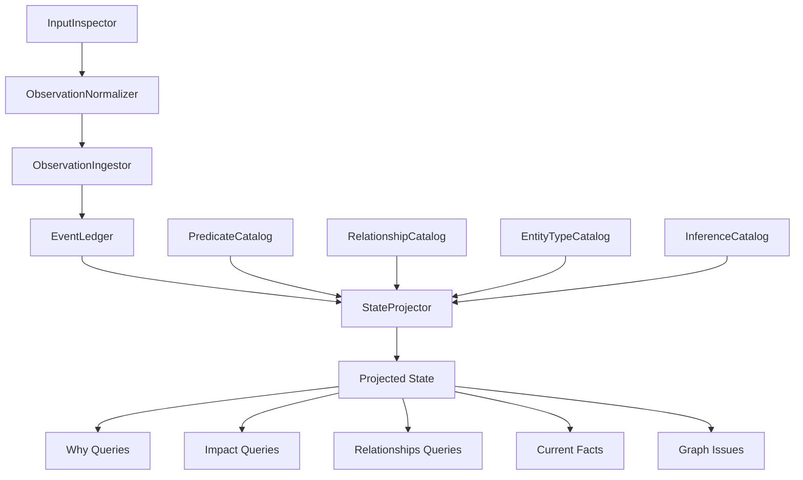
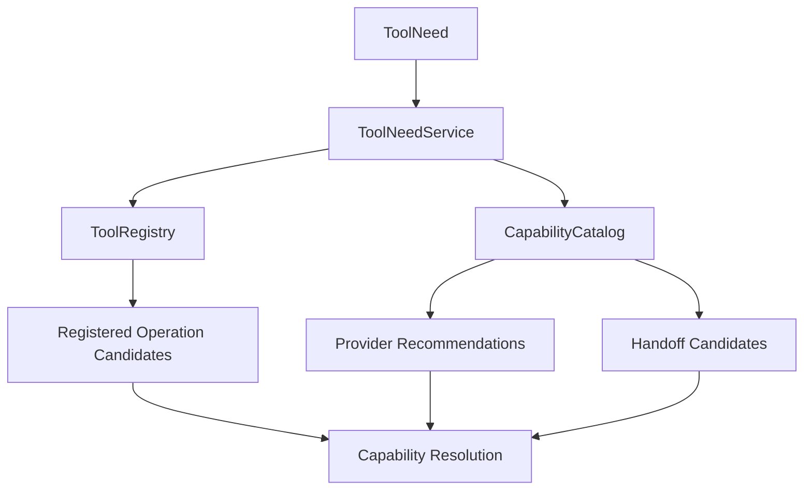
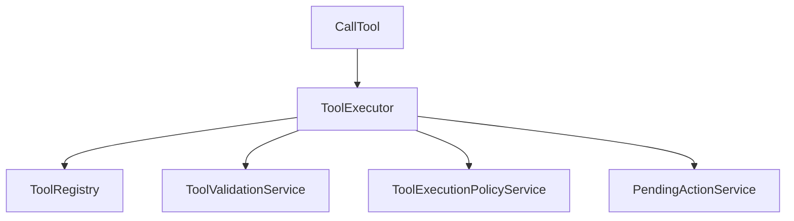
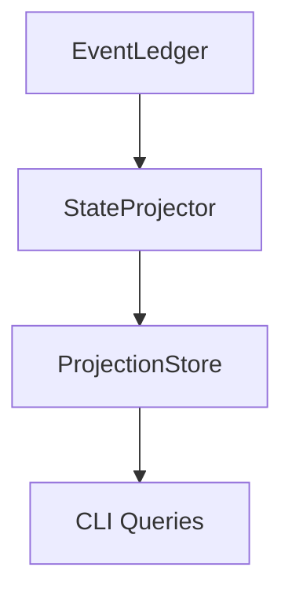

> **Historical/stale after PR 1918.** This document is preserved as historical testimony only. Its Runtime, RuntimeLoop, Decision, Policy, Execution, ActionPlan, HandoffPlan, ExecutionProposal, ExecutionAuthorization, PendingAction, request_tool, call_tool, and builder-candidate language is not current architecture or operator instruction.

# Function Blocks

These function-block diagrams document the current core Seed architecture. They are guardrails for ownership, not implementation tasks.

## Knowledge Pipeline

The knowledge pipeline turns inputs into observations, observations into ledger-backed knowledge, and ledger-backed knowledge into projected state. Query surfaces consume projected state; they do not own the event history.

## Capability Resolution Pipeline

`ToolNeedService` owns capability-gap creation and capability resolution. `ToolRegistry` owns registered operation inventory. `CapabilityCatalog` owns capability metadata, provider recommendations, and handoff recommendations.

## Execution Boundary

Only `call_tool` may enter `ToolExecutor`. `request_tool`, `answer`, `question`, and `refusal` remain runtime response or reasoning paths. Execution starts at `ToolExecutor`; earlier blocks validate, route, explain, or reason.

## Projection Cache

`ProjectionStore` caches projections.

`EventLedger` stores history.

The projection cache is not a second event store. Cached projections can be rebuilt from append-only events and projector logic.
